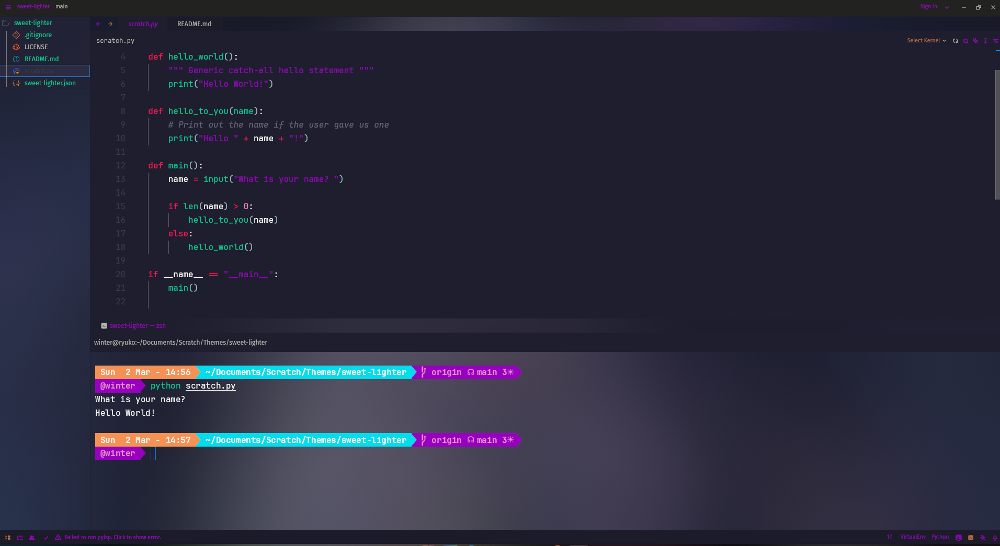
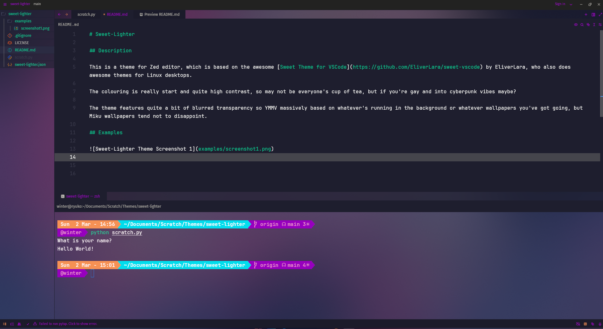
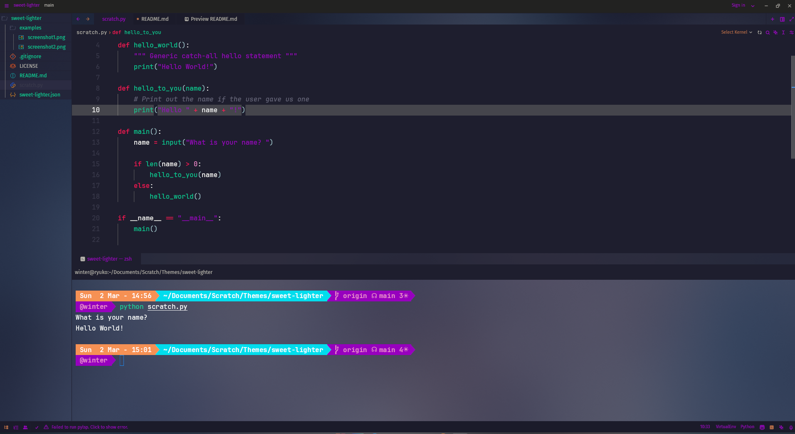
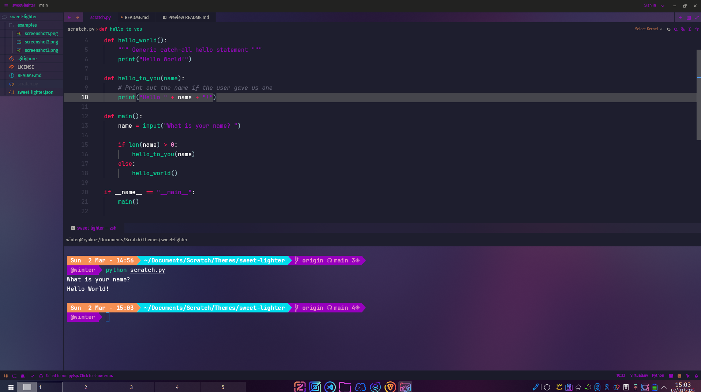

# Sweet-Lighter

## Description

This is a theme for Zed editor, which is based on the awesome [Sweet Theme for VSCode](https://github.com/EliverLara/sweet-vscode) by EliverLara, who also does awesome themes for Linux desktops.

The colouring is really start and quite high contrast, so may not be everyone's cup of tea, but if you're gay and into cyberpunk vibes maybe?

The theme features quite a bit of blurred transparency so YMMV massively based on whatever's running in the background or whatever wallpapers you've got going, but Miku wallpapers tend not to disappoint.

## Examples

